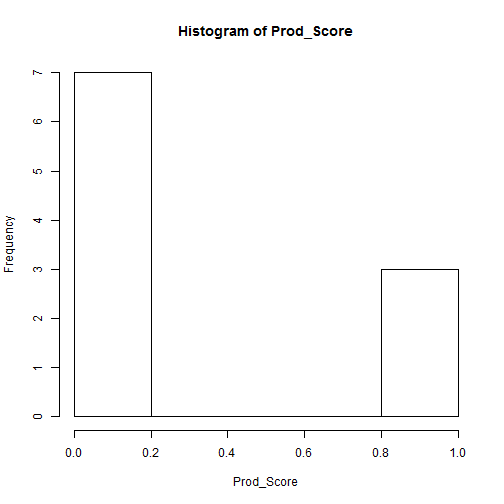
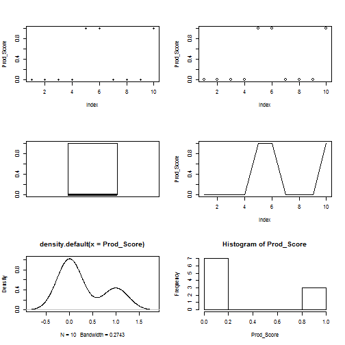

Coursera Data Products Project Presentation
========================================================
author: Sathya Shanmugavelu
date: 3-Sep-2016
autosize: true


Project Score
========================================================

- This presentation is being created as part of the peer assessment for the coursera developing data products class. The assignment is geared toward ensuring the following concepts were well understood by the students

- R Shiny to build data product application
- R-Presentation or slidify to create data product related presentations


Application Scope : Employee Productivity
========================================================


- Employee Productivity is computed based on the Number of the Tickets Employee Solved

- Based on Tickets Resolved , an appropriate Productivity Score is being Predicted

- Using Predicted Score , Insights on whether Employee is Low (or) High Productive is made

- For simplicity , the prediction algorithm using simple mathematical operations here


Setting the Data - Emplolyee Productivity Data and its Score
========================================================

```r
# Set Employee and their ticket resolution along with the association productivity score
Emp_ID <- c(1,2,3,4,5,6,7,8,9,10)
Tkt_Count <- c(50,80,120,150,155,200,60,90,99,160)
Prod_Score <- c(0 , 0 , 0 , 0 , 1 , 1 , 0 , 0 , 0,  1)
```

Summary Statistics - For Employee Productivity Score
========================================================

```r
summary(cars)
```

```
     speed           dist       
 Min.   : 4.0   Min.   :  2.00  
 1st Qu.:12.0   1st Qu.: 26.00  
 Median :15.0   Median : 36.00  
 Mean   :15.4   Mean   : 42.98  
 3rd Qu.:19.0   3rd Qu.: 56.00  
 Max.   :25.0   Max.   :120.00  
```


Visualization  - For Employee Productivity Score
========================================================

```r
hist(Prod_Score)
```



MultiPanel Visualization Plots  - For Employee Productivity Score
========================================================

```r
par(mfrow=c(3,2))
sunflowerplot(Prod_Score)
plot(Prod_Score)
boxplot(Prod_Score)
plot(Prod_Score, type = 'l')
plot(density(Prod_Score))
hist(Prod_Score)
```




Basic Inference  - Insights from the Employee Productivity Score
========================================================

- Employee Productivity Score is a function of the Ticket Count resolved

- Based on the Ticket count solved , the algortihm computes the productivity score

- Computation is done in the Shiny Server and the results of Prediction provided for Inference

- A high productivity score entiles a high productivity and vice versa

- Some visualizations are provided to get some added insights
